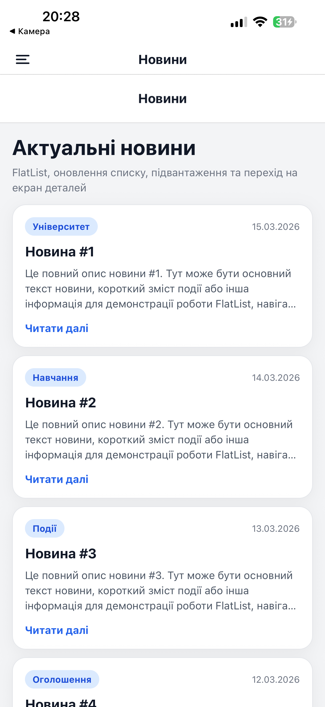
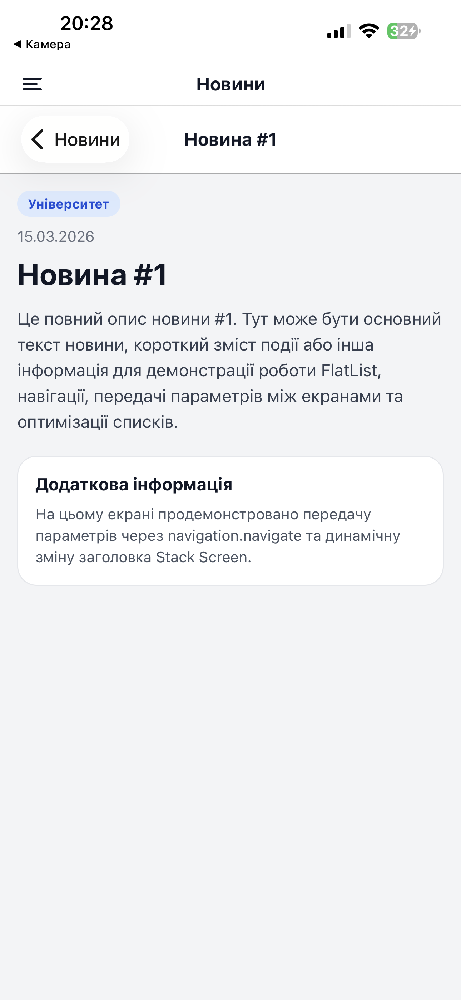
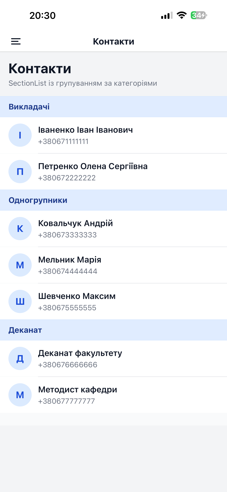
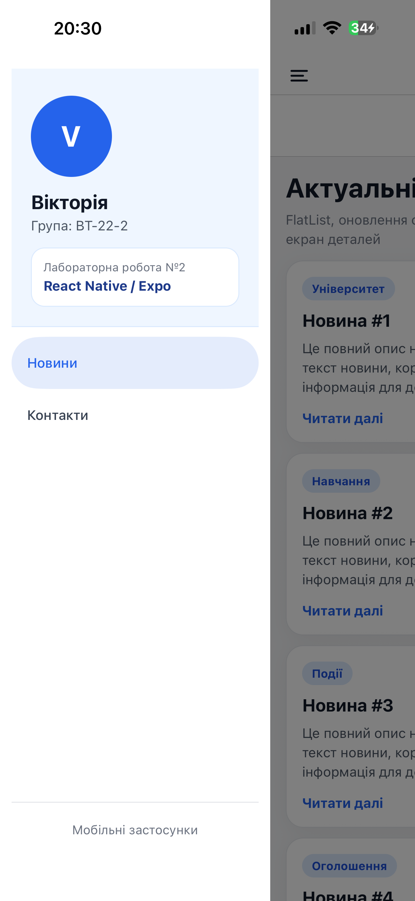

# Лабораторна робота №2

## Підключення навігації (App.js)

``` javascript
import 'react-native-gesture-handler';
import React from 'react';
import { NavigationContainer } from '@react-navigation/native';
import DrawerNavigator from './src/navigation/DrawerNavigator';

export default function App() {
  return (
    <NavigationContainer>
      <DrawerNavigator />
    </NavigationContainer>
  );
}
```

Цей файл є точкою входу застосунку.

------------------------------------------------------------------------

# Drawer Navigator

``` javascript
import { createDrawerNavigator } from '@react-navigation/drawer';
import NewsStackNavigator from './NewsStackNavigator';
import ContactsScreen from '../screens/ContactsScreen';

const Drawer = createDrawerNavigator();

export default function DrawerNavigator() {
  return (
    <Drawer.Navigator>
      <Drawer.Screen
        name="News"
        component={NewsStackNavigator}
        options={{ drawerLabel: 'Новини' }}
      />
      <Drawer.Screen
        name="Contacts"
        component={ContactsScreen}
        options={{ drawerLabel: 'Контакти' }}
      />
    </Drawer.Navigator>
  );
}
```

------------------------------------------------------------------------

# Використання FlatList

``` javascript
<FlatList
  data={news}
  keyExtractor={(item) => item.id}
  renderItem={({ item }) => (
    <NewsItem item={item} onPress={openDetails} />
  )}
  refreshing={refreshing}
  onRefresh={onRefresh}
  onEndReached={onLoadMore}
  onEndReachedThreshold={0.5}
/>
```

------------------------------------------------------------------------

# Передача параметрів між екранами

``` javascript
navigation.navigate('Details', {
  newsItem: item,
});
```

Отримання параметрів:

``` javascript
const { newsItem } = route.params;
```

------------------------------------------------------------------------

# SectionList

``` javascript
<SectionList
  sections={contactsSections}
  keyExtractor={(item) => item.id}
  renderItem={({ item }) => (
    <Text>{item.name}</Text>
  )}
  renderSectionHeader={({ section }) => (
    <Text>{section.title}</Text>
  )}
/>
```

------------------------------------------------------------------------

# Скріншоти застосунку

## Головний екран новин



## Деталі новини



## Екран контактів



## Drawer Menu



------------------------------------------------------------------------

# Інструкція запуску

### 1. Встановити залежності

npm install

### 2. Запустити застосунок

npx expo start

### 3. Відкрити через Expo Go або емулятор

------------------------------------------------------------------------


