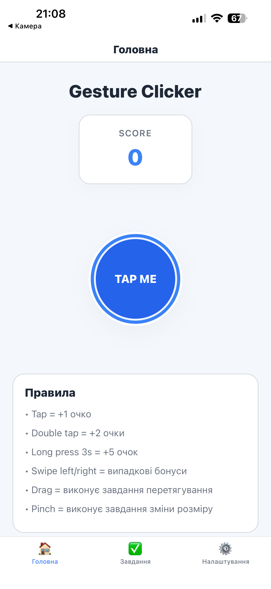
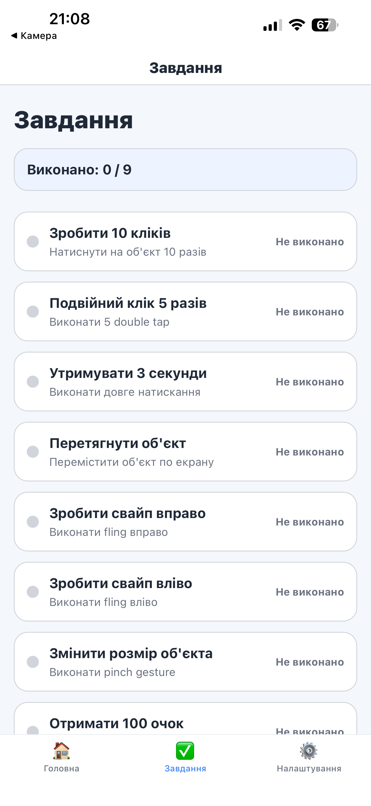
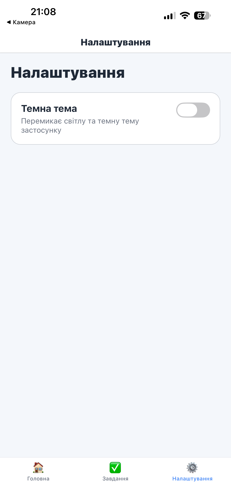
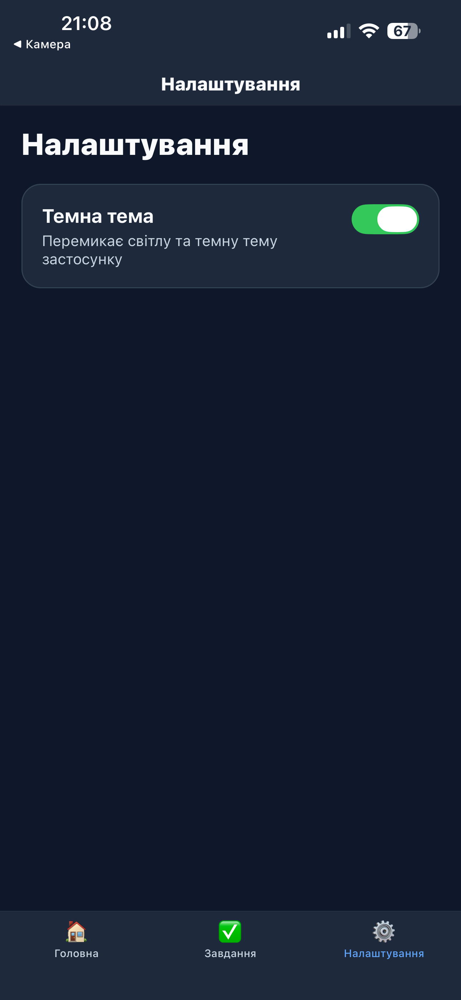
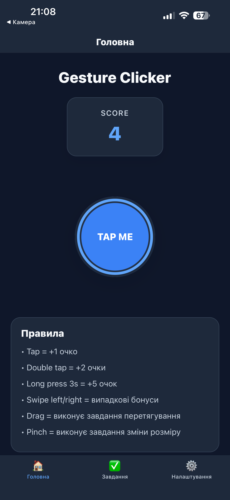
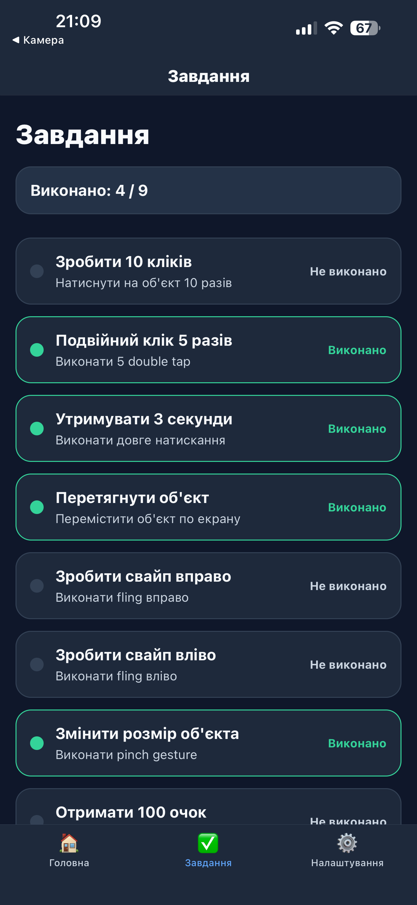
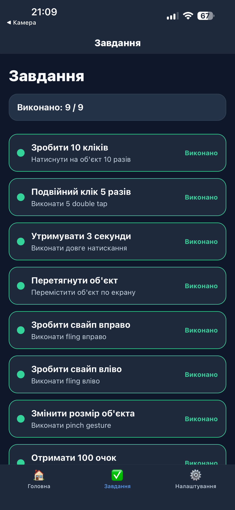

# Лабораторна робота №3  


## Tap Gesture

```javascript
const singleTap = Gesture.Tap()
  .numberOfTaps(1)
  .maxDuration(250)
  .onEnd((_event, success) => {
    if (success) {
      onAction("tap");
    }
  });
```

## Double Tap Gesture

```javascript
const doubleTap = Gesture.Tap()
  .numberOfTaps(2)
  .maxDuration(250)
  .onEnd((_event, success) => {
    if (success) {
      onAction("doubleTap");
    }
  });
```

## Long Press Gesture

```javascript
const longPress = Gesture.LongPress()
  .minDuration(3000)
  .onEnd((_event, success) => {
    if (success) {
      onAction("longPress");
    }
  });
```

## Pan Gesture

```javascript
const panGesture = Gesture.Pan()
  .onUpdate((event) => {
    translateX.setValue(event.translationX);
    translateY.setValue(event.translationY);
  })
  .onEnd(() => {
    onAction("drag");
  });
```

## Pinch Gesture

```javascript
const pinch = Gesture.Pinch()
  .onUpdate((event) => {
    let nextScale = lastScale.current * event.scale;
    scale.setValue(nextScale);
  })
  .onEnd(() => {
    onAction("pinch");
  });
```

---

# Система завдань

У застосунку реалізовано список завдань:

- зробити **10 кліків**
- виконати **5 подвійних кліків**
- утримувати об'єкт **3 секунди**
- перетягнути об'єкт
- зробити свайп вправо
- зробити свайп вліво
- змінити розмір об'єкта
- набрати **100 очок**
- власне завдання

---

# Приклад структури завдань

```javascript
export const initialChallenges = [
  {
    id: "tap10",
    title: "Зробити 10 кліків",
    description: "Натиснути на об'єкт 10 разів",
    completed: false
  },
  {
    id: "double5",
    title: "Подвійний клік 5 разів",
    description: "Виконати 5 double tap",
    completed: false
  }
];
```

---

# Реалізація лічильника очок

```javascript
const [score, setScore] = useState(0);

const handleGestureAction = (type) => {

  if(type === "tap"){
    setScore(prev => prev + 1);
  }

  if(type === "doubleTap"){
    setScore(prev => prev + 2);
  }

  if(type === "longPress"){
    setScore(prev => prev + 5);
  }

};
```

---

# Навігація

```javascript
import { NavigationContainer } from "@react-navigation/native";
import { createBottomTabNavigator } from "@react-navigation/bottom-tabs";

const Tab = createBottomTabNavigator();

function App() {
  return (
    <NavigationContainer>
      <Tab.Navigator>
        <Tab.Screen name="Home" component={HomeScreen}/>
        <Tab.Screen name="Challenges" component={ChallengesScreen}/>
        <Tab.Screen name="Settings" component={SettingsScreen}/>
      </Tab.Navigator>
    </NavigationContainer>
  );
}
```

---


# Інструкція запуску

```bash
npm install
npx expo start
```

Відкрийте застосунок через **Expo Go** або емулятор.

---
# Скріншоти

!(screenshots/home.PNG)






