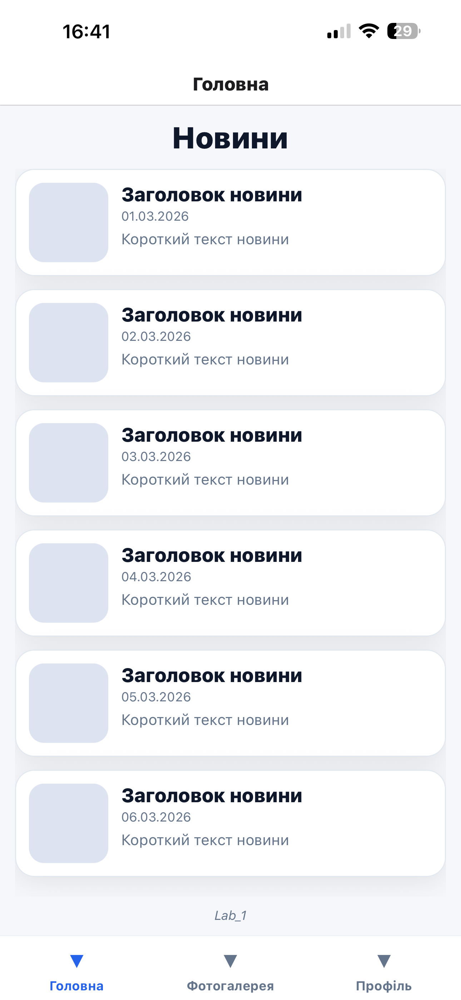
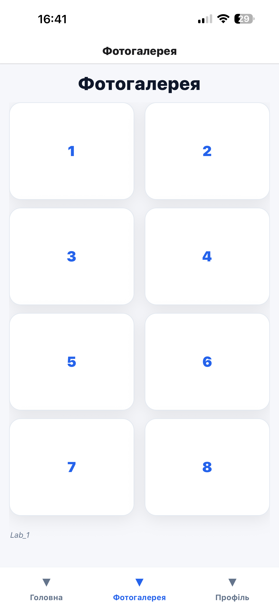
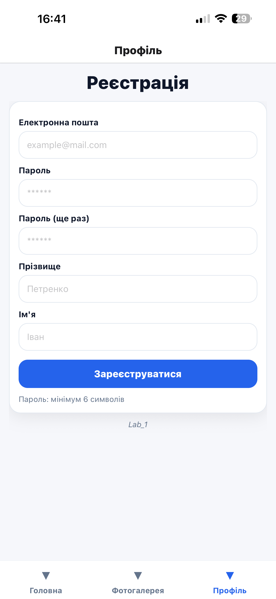
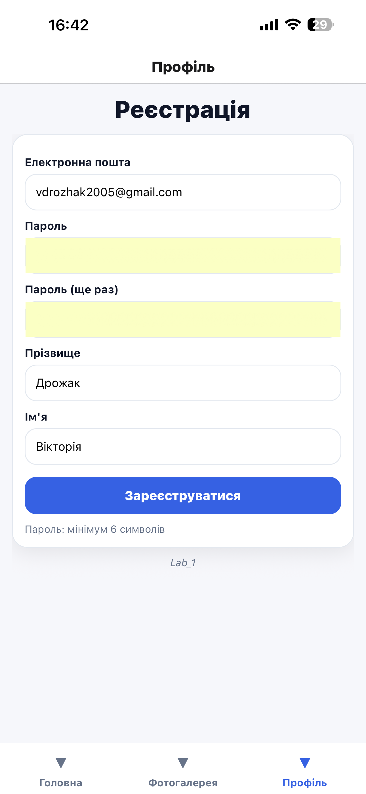
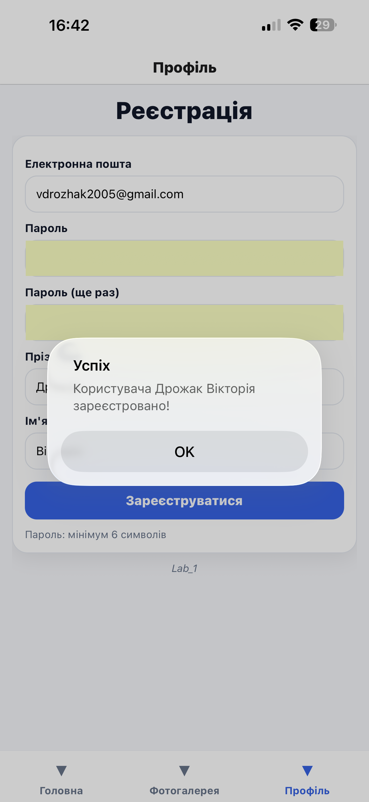
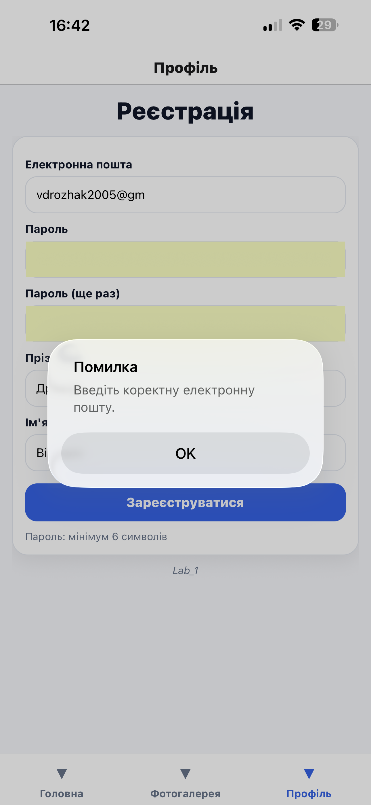

## Лабораторна робота №1


#  Основні фрагменти коду

##  index.js — точка входу

```javascript
import { registerRootComponent } from "expo";
import App from "./App";

registerRootComponent(App);
```

Реєструє головний компонент застосунку.

---

## App.js — контейнер навігації

```javascript
import React from "react";
import { NavigationContainer } from "@react-navigation/native";
import TabNavigator from "./src/navigation/TabNavigator";

export default function App() {
    return (
        <NavigationContainer>
            <TabNavigator />
        </NavigationContainer>
    );
}
```

---

## TabNavigator.js — нижня навігація

```javascript
import React from "react";
import { createBottomTabNavigator } from "@react-navigation/bottom-tabs";

import HomeScreen from "../screens/HomeScreen";
import GalleryScreen from "../screens/GalleryScreen";
import ProfileScreen from "../screens/ProfileScreen";

const Tab = createBottomTabNavigator();

export default function TabNavigator() {
    return (
        <Tab.Navigator>
            <Tab.Screen name="Головна" component={HomeScreen} />
            <Tab.Screen name="Фотогалерея" component={GalleryScreen} />
            <Tab.Screen name="Профіль" component={ProfileScreen} />
        </Tab.Navigator>
    );
}
```

---

## Дані новин (news.js)

```javascript
export const NEWS = [
    { id: "1", title: "Новина 1", date: "01.03.2026", text: "Текст новини" },
    { id: "2", title: "Новина 2", date: "02.03.2026", text: "Текст новини" }
];
```

---

## HomeScreen — використання FlatList

```javascript
<FlatList
    data={NEWS}
    keyExtractor={(item) => item.id}
    renderItem={({ item }) => (
        <View style={styles.card}>
            <Text style={styles.title}>{item.title}</Text>
            <Text>{item.date}</Text>
            <Text>{item.text}</Text>
        </View>
    )}
/>
```

---

## GalleryScreen — сітка з ScrollView

```javascript
<ScrollView contentContainerStyle={styles.container}>
    {Array.from({ length: 8 }).map((_, index) => (
        <View key={index} style={styles.tile}>
            <Text>{index + 1}</Text>
        </View>
    ))}
</ScrollView>
```

---

##  ProfileScreen — useState та форма

```javascript
import React, { useState } from "react";

const [email, setEmail] = useState("");
const [password, setPassword] = useState("");
```

### Поля введення:

```javascript
<TextInput
    value={email}
    onChangeText={setEmail}
    placeholder="Email"
    keyboardType="email-address"
/>

<TextInput
    value={password}
    onChangeText={setPassword}
    secureTextEntry={true}
    placeholder="Пароль"
/>
```

---

##  Валідація форми

```javascript
const handleSubmit = () => {
    if (!email.includes("@")) {
        Alert.alert("Помилка", "Некоректний email");
        return;
    }
    Alert.alert("Успіх", "Реєстрація успішна");
};
```

---

## Стилізація через StyleSheet

```javascript
const styles = StyleSheet.create({
    container: {
        flex: 1,
        padding: 16,
        backgroundColor: "#F6F7FB",
    },
    card: {
        padding: 12,
        marginBottom: 10,
        backgroundColor: "#FFFFFF",
        borderRadius: 12,
    },
});
```

---

#  Інструкція із запуску

## Встановлення залежностей

npm install

## Запуск

npx expo start


---

#  Способи запуску

## 1. Expo Go
- Сканування QR-коду
- Найшвидший спосіб тестування

## 2. Android Emulator
- Потрібен Android Studio
- Запуск клавішею "a"

## 3. iOS Simulator
- Потрібен Xcode
- Запуск клавішею "i"

## 4. Web
- Запуск клавішею "w"

---

# Скріншоти









---
