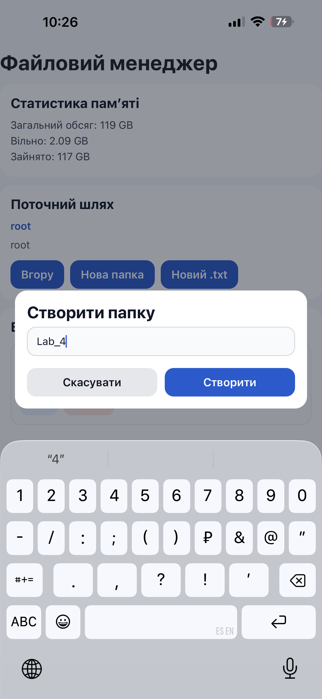
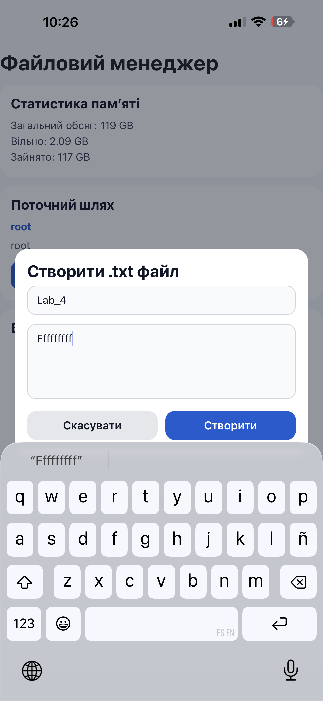
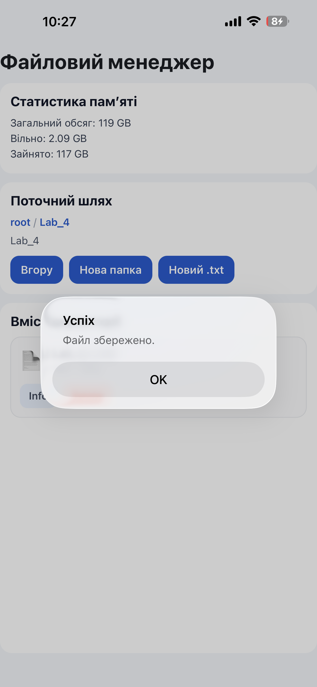
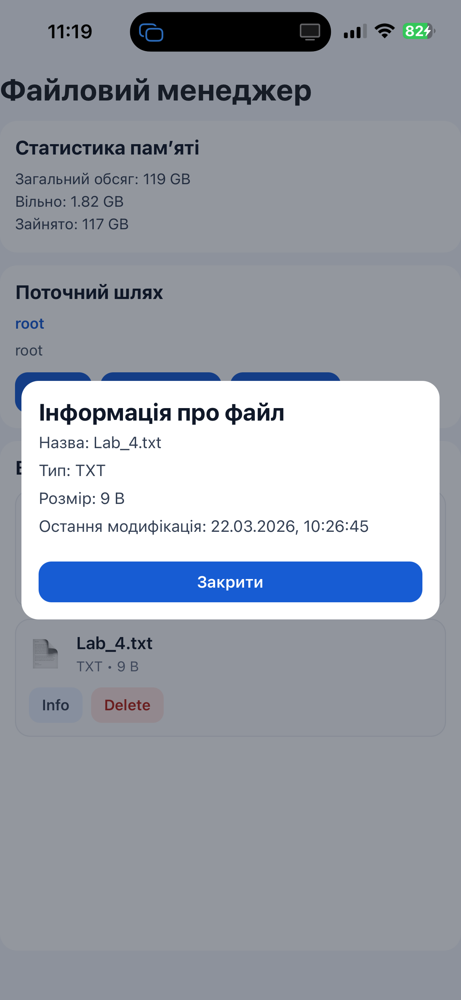

# Лабораторна робота №4  


### 4. Запуск застосунку
```bash
npx expo start
```


Після запуску застосунок створює робочу директорію в локальному сховищі:

```js
const ROOT_DIR = `${FileSystem.documentDirectory}file-manager/`;
```

Ця папка є кореневою директорією файлового менеджера. Саме в ній зберігаються створені користувачем папки та текстові файли.

При першому запуску:
1. перевіряється наявність кореневої папки;
2. якщо папка не існує — вона створюється;
3. завантажується список файлів і папок;
4. отримується інформація про загальний і вільний обсяг пам’яті.

---

## Реалізований функціонал

### 1. Перегляд вмісту директорії
Застосунок зчитує список елементів у поточній папці за допомогою:

```js
FileSystem.readDirectoryAsync(dirUri)
```

Для кожного елемента окремо отримується інформація:
- назва;
- шлях;
- тип (файл або папка);
- розмір;
- дата останньої зміни.

Папки відображаються першими, а потім файли.

---

### 2. Навігація між папками
Якщо користувач натискає на папку, виконується перехід у неї.  
Поточний шлях відображається у верхній частині інтерфейсу.

Також реалізовано:
- кнопку **«Вгору»** для переходу до батьківської папки;
- breadcrumb-навігацію, яка дозволяє швидко перейти до будь-якого рівня вкладеності.

---

### 3. Створення папки
Користувач може створити нову папку в поточній директорії.

Для цього:
1. відкривається модальне вікно;
2. вводиться назва папки;
3. виконується перевірка на порожнє поле;
4. перевіряється, чи не існує вже папка з такою назвою;
5. викликається:

```js
FileSystem.makeDirectoryAsync(uri, { intermediates: true })
```

Після успішного створення список файлів автоматично оновлюється.

---

### 4. Створення текстового файлу
Користувач може створити новий `.txt` файл.

Особливості:
- якщо користувач не ввів розширення `.txt`, воно додається автоматично;
- можна одразу ввести початковий текст файлу;
- якщо файл з такою назвою вже існує, виводиться попередження.

Для створення файлу використовується:

```js
FileSystem.writeAsStringAsync(uri, newFileContent, {
  encoding: FileSystem.EncodingType.UTF8,
})
```

---

### 5. Відкриття і редагування текстового файлу
Редагування доступне лише для файлів з розширенням `.txt`.

При відкритті файлу:
1. файл зчитується;
2. його вміст підставляється в `TextInput`;
3. відкривається окремий екран редагування.

Для читання використовується:

```js
FileSystem.readAsStringAsync(item.uri, {
  encoding: FileSystem.EncodingType.UTF8,
})
```

Редактор має:
- заголовок;
- назву файлу;
- шлях до файлу;
- кнопку **«Скасувати»**;
- кнопку **«Зберегти»**;
- текстове поле для редагування вмісту.

Кнопки розміщені зверху для зручнішої взаємодії з інтерфейсом.

---

### 6. Збереження змін
Після редагування вмісту файлу користувач може натиснути **«Зберегти»**.

Для запису використовується:

```js
FileSystem.writeAsStringAsync(selectedFileUri, editorText, {
  encoding: FileSystem.EncodingType.UTF8,
})
```

Після успішного збереження:
- показується повідомлення про успіх;
- редактор закривається;
- список файлів оновлюється.

---

### 7. Видалення файлів і папок
Для кожного елемента доступна кнопка **Delete**.

Перед видаленням показується діалог підтвердження.  
Якщо користувач підтверджує дію, виконується:

```js
FileSystem.deleteAsync(item.uri, { idempotent: true })
```

Після видалення вміст директорії оновлюється.

---

### 8. Інформація про файл
Для кожного файлу або папки доступна кнопка **Info**.

У модальному вікні відображається:
- назва;
- тип;
- розмір;
- дата останньої модифікації.

Ця інформація отримується через:

```js
FileSystem.getInfoAsync(uri)
```

---

### 9. Статистика пам’яті пристрою
У верхній частині застосунку відображається інформація про пам’ять:
- загальний обсяг;
- вільний простір;
- зайнятий простір.

Для цього використовуються методи:

```js
FileSystem.getFreeDiskStorageAsync()
FileSystem.getTotalDiskCapacityAsync()
```

Зайнятий простір обчислюється як різниця між загальним та вільним.

---

## Інтерфейс застосунку

Інтерфейс застосунку складається з кількох основних блоків:

### Головний екран:
- заголовок застосунку;
- статистика пам’яті;
- поточний шлях;
- кнопки керування;
- список файлів і папок.

### Доступні кнопки:
- **Вгору** — перехід до батьківської папки;
- **Нова папка** — створення нової папки;
- **Новий .txt** — створення нового текстового файлу;
- **Info** — перегляд інформації;
- **Delete** — видалення елемента;
- **Скасувати** — закриття редактора без збереження;
- **Зберегти** — запис змін у файл.

### Додаткові вікна:
- модальне вікно створення папки;
- модальне вікно створення файлу;
- модальне вікно перегляду інформації;
- повноекранне вікно редагування файлу.

---

## Основні функції програми

### `init()`
Ініціалізує файлову систему:
- перевіряє існування кореневої папки;
- створює її за потреби;
- завантажує вміст директорії;
- оновлює статистику пам’яті.

### `loadDirectory(dirUri)`
Завантажує вміст обраної директорії та формує масив елементів для відображення.

### `goUp()`
Переходить до батьківської папки.

### `openEntry(item)`
Відкриває папку або `.txt` файл.

### `saveFile()`
Зберігає змінений текст у файл.

### `createFolder()`
Створює нову папку в поточній директорії.

### `createFile()`
Створює новий текстовий файл.

### `confirmDelete(item)`
Показує підтвердження перед видаленням і видаляє обраний елемент.

### `showInfo(item)`
Відкриває вікно з детальною інформацією про файл або папку.

---

## Переваги реалізованого рішення

- простий і зрозумілий інтерфейс;
- робота повністю на JavaScript;
- відсутність TypeScript;
- підтримка базових операцій з файлами та папками;
- сучасний адаптивний дизайн;
- зручний редактор файлів з кнопками зверху;
- автоматичне оновлення вмісту після кожної дії.

---

## Можливі покращення

У майбутньому застосунок можна вдосконалити:
- додати підтримку інших типів файлів;
- реалізувати перейменування файлів і папок;
- додати пошук по назвах файлів;
- реалізувати сортування за датою або розміром;
- додати іконки різних типів файлів;
- реалізувати копіювання та переміщення файлів;
- додати темну тему інтерфейсу.

---

## Висновок

У результаті виконання лабораторної роботи було створено мобільний застосунок **«Файловий менеджер»** на **React Native** з використанням **Expo SDK 54** та бібліотеки **expo-file-system**.

У ході виконання роботи було реалізовано:
- створення папок;
- створення текстових файлів;
- відкриття та редагування файлів;
- збереження змін;
- видалення файлів і папок;
- навігацію по локальній файловій системі;
- перегляд атрибутів файлів;
- виведення статистики пам’яті.

Таким чином, мету роботи досягнуто, а отриманий застосунок демонструє практичне використання файлової системи в мобільному застосунку на React Native.

---

## Скріншоти

У цей розділ потрібно додати скріншоти:
1. головного екрана;
2. створення папки;
3. створення файлу;
4. редагування файлу;
5. перегляду інформації про файл.

Приклад оформлення:


## Скріншоти

### Головний екран


### Створення папки
)

### Створення файлу



### Редагування файлу


### Інформація про редагування 


### Інформація про файл

```


## Команди для запуску

```bash
npm install
npx expo install expo-file-system
npx expo start
```

---


